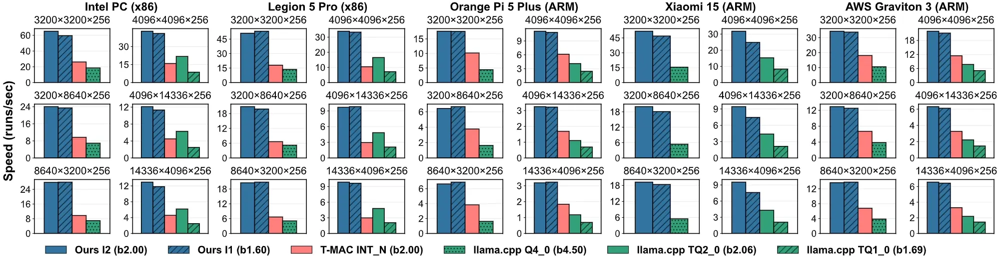

# vlut.cpp

[](https://opensource.org/licenses/MIT)
[](https://arxiv.org/abs/2512.06443)
[](https://huggingface.co/collections/XXXXyu/vlutcpp)

vlut.cpp (lookup table-based) vs. [llama.cpp](https://github.com/ggml-org/llama.cpp) (dequantization-based) running [Llama3-8B-1.58-100B-tokens](https://huggingface.co/HF1BitLLM/Llama3-8B-1.58-100B-tokens) on Intel Core Ultra 7 258V (see [run_batched_decode.sh](evaluation/demo/run_batched_decode.sh)):

https://github.com/user-attachments/assets/d38908fb-a5f4-4a48-ba44-373057c3de39

vlut.cpp vs. [llama.cpp](https://github.com/ggml-org/llama.cpp) vs. [T-MAC](https://github.com/microsoft/T-MAC) in GeMM kernel benchmark (see [Evaluation.md](evaluation/Evaluation.md) for a detailed evaluation guide):



## Introduction

vlut.cpp is a lightweight extension of [llama.cpp](https://github.com/ggml-org/llama.cpp) that implements [*Vec-LUT: Vector Table Lookup for Parallel Ultra-Low-Bit LLM Inference on Edge Devices*](https://arxiv.org/abs/2512.06443). It targets *parallel ultra-low-bit* LLM inference. Parallel scenarios include:

- Prefilling (parallel input, most common).
- Serving (mixed parallel input and output).
- Parallel test-time scaling and speculative decoding (parallel output).

The Vec-LUT kernel is fast with:

- Lookup table (LUT)-based design that replaces dequantization and multiplication with efficient table lookup.
- Vector LUT paradigm that performs efficient 1→N lookup and turns random lookup into contiguous vector addition.
- Vector LUT-centric tensor layout and cache-aware streamed lookup that optimizes the memory access patterns.

Based on the Vec-LUT kernel, vlut.cpp is efficient and easy to use with:

- llama.cpp-compatible kernel integration and similar usage.
- Heuristic tiling strategy without costly tuning.

## Supported Platforms

vlut.cpp supports all mainstream CPUs (Intel, AMD, ARM), and operating systems (Linux, Android, Mac OS, Windows). You can build and test vlut.cpp on almost any platforms.

> We recommend using the [Windows Subsystem for Linux (WSL)](https://learn.microsoft.com/en-us/windows/wsl/install) on Windows, and [Termux](https://termux.dev/en) on Android. They provide Linux-like development environments.

Please refer to [Evaluation.md](evaluation/Evaluation.md#devices) for recommended specifications to run the evaluation.

## Supported Models

vlut.cpp now supports a rich set of ternary (1.58-bit) LLMs:

- **HF BitNet family**
  - Example: [`1bitLLM/bitnet_b1_58-3B`](https://huggingface.co/1bitLLM/bitnet_b1_58-3B)
- **Llama family (1.58-bit variants)**
  - Example: [`HF1BitLLM/Llama3-8B-1.58-100B-tokens`](https://huggingface.co/HF1BitLLM/Llama3-8B-1.58-100B-tokens)
- **Falcon3 family**
  - Example: [`tiiuae/Falcon3-1B-Instruct-1.58bit`](https://huggingface.co/tiiuae/Falcon3-1B-Instruct-1.58bit)
- **TriLM family**
  - Example: [`SpectraSuite/TriLM_3.9B_Unpacked`](https://huggingface.co/SpectraSuite/TriLM_3.9B_Unpacked)

We provide pre-converted models for immediate on-device deployment with vlut.cpp. Checkout [1.58-bit LLMs for vlut.cpp](https://huggingface.co/collections/XXXXyu/vlutcpp) on Huggingface.

## Quick Start

This section walks you through the minimum steps required to run a ternary LLM with vlut.cpp:

1. **Install and build** vlut.cpp.
1. **Convert** a HuggingFace model into vlut-compatible GGUF.  
2. **Quantize** the model using Vec-LUT packings (I1 / I2).  
3. **Run** inference using `llama-cli` or benchmark with `llama-bench`.

For a more detailed evaluation pipeline (GeMM, prefill, batched decoding, multi-framework comparison), see [Evaluation.md](evaluation/Evaluation.md).

### 1. Installation

vlut.cpp follows the same build process as llama.cpp (CPU build), see [how to build](docs/build.md#cpu-build).

Run the following commands to build vlut.cpp with 4 parallel jobs:

```bash
cmake -B build
cmake --build build --config Release -j 4
```

### 2. Convert a HuggingFace model to GGUF

Before quantization, HuggingFace models (safetensors) must be converted to vlut GGUF. Skip this step if you use our pre-converted models.

Install dependencies:

```bash
pip install -r requirements.txt
```

Convert a model (BitNet 3B for example):

```bash
python ./convert_hf_to_gguf_vlut.py ~/models/bitnet_b1_58-3B --outfile ~/models/bitnet_b1_58-3B/bitnet_b1_58-3B.vlut.gguf
```

### 3. Quantize the model with Vec-LUT packings

vlut.cpp provides lossless ternary packings **I1** and **I2**, with optional K-tiling variants (e.g., `I1_V_2`, `I2_V_4`). Skip this step if you use our pre-converted models.

Quantize the converted GGUF:

```bash
./build/bin/llama-quantize ~/models/bitnet_b1_58-3B/bitnet_b1_58-3B.vlut.gguf I1_V_2

./build/bin/llama-quantize ~/models/bitnet_b1_58-3B/bitnet_b1_58-3B.vlut.gguf I2_V_4
```

The quantized model will be saved as `ggml-model-{quant_type}.gguf`.

### 4. Run inference

Use `llama-batched` to run a parallel inference:

```bash
./build/bin/llama-batched \
  -m ~/models/bitnet_b1_58-3B/ggml-model-I2_V_4.gguf \
  -p "I believe the meaning of life is" \
  -np 32 -n 16 -t 1 --temp 0.5 --repeat-penalty 1.5
```

### 5. Benchmark performance

`llama-bench` lets you measure the performance of the inference for various parameters.

example:

```bash
./build/bin/llama-bench -m model.gguf -t 4 -p 128 -n 0
```

## Acknowledgement

This project is built atop [llama.cpp](https://github.com/ggml-org/llama.cpp). Thanks to all the contributors for their valuable works!

The LUT-based idea is inspired by [T-MAC](https://github.com/microsoft/T-MAC/), which is primarily optimized for *non-parallel* scenarios (e.g., single-batch decoding).

## Citation

If you find this project useful, please cite our [paper](https://arxiv.org/abs/2512.06443):

```bibtex
@article{li2025veclut,
  title={Vec-LUT: Vector Table Lookup for Parallel Ultra-Low-Bit LLM Inference on Edge Devices},
  author={Li, Xiangyu and Yin, Chengyu and Wang, Weijun and Wei, Jianyu and Cao, Ting and Liu, Yunxin},
  journal={arXiv preprint arXiv:2512.06443},
  year={2025},
  url={https://arxiv.org/abs/2512.06443}
}
```
